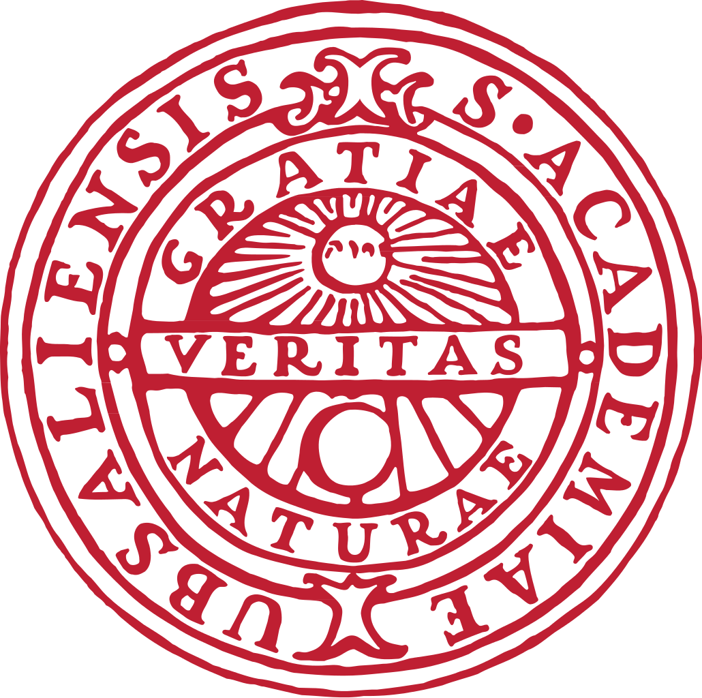

It can be difficult to navigate the different organisations, websites, and various bits of
advice surrounding compute and storage resources in the academic world. This lesson will
hopefully clarify what is what, who is who, and so on.

## SNIC

At the top, there is the [Swedish National Infrastructure for Computing (SNIC)](https://www.snic.se).
SNIC is funded by the Research Council and a consortium of Swedish universities for the purpose
of providing large-scale computing and storage infrastructure for Swedish academic research.
These resources and related services are provided for free to users.

Six universities are SNIC partners, which means they host one or more SNIC systems. Uppsala
University is one of these, and [UPPMAX](https://www.uppmax.uu.se) is the high-performance
computing (HPC) center at Uppsala University.

> ## SNIC centra
> The six SNIC partners are:
> - Umeå University (HPC2N)
> - Uppsala University (UPPMAX)
> - KTH Royal Institute of Technology (PDC)
> - Linköping University (NSC)
> - Chalmers Technical University (C3SE)
> - Lund University (Lunarc)
{: .callout}

All SNIC partners collaborate on common infrastructures and projects, such as off-site backup,
software licenses, the [SNIC Science Cloud](https://cloud.snic.se), and the project management
portal [SUPR](https://supr.snic.se).

## SUPR

As mentioned, SNIC provides computational and storage resources to Swedish academic researchers,
and does so for "free". Obviously, this has to be done accountably and fairly. The SNIC User
and Project Repository (SUPR) is the common interface that users and staff use to apply for,
evaluate, and approve projects.

All SNIC resources are allocated to projects. Project members share the resources of each
project and can have accounts on the systems on which the project has a resource allocation.
Everyone who wants to use a SNIC system must first create a personal user account in SUPR.
PI's create and submit proposals for project they would like to do, including requests for
the resources they need. Proposals are then approved or denied by the allocation committee,
[SNAC](https://www.snic.se/allocations/snac/), or its working group.

## UPPMAX

This material is written by UPPMAX, and the course is aimed primarily at new users of our systems.
As already mentioned, UPPMAX is a part of Uppsala University. More specifically, we are a part
of the Department of Information Technology. As a center at UU, we are more than merely part
of the national HPC infrastructure, we also collaborate directly with researchers in a variety
of ways. If your group has a special need for HPC-related resources or expertise, please contact
our excellent support or our wonderful director.

## Other organisations

A few other organisations tend to be mentioned in the same breath as UPPMAX. Let's go over
them here to avoid confusion in the future.

UPPMAX hosts the SciLifeLab Compute and Storage facility, which is a part of the Bioinformatics
Platform (NBIS). The purpose of this facility is two-fold: to act as a bridge between the support
provided by NBIS and the support provided by SNIC/UPPMAX, and to support life science researchers'
compute and storage needs more generally. The presence of this facility within UPPMAX is a
result of, and contributes to, UPPMAX's focus on data-intensive sciences.

[NBIS](www.nbis.se) is the national infrastructure for bioinformatics. They can provide expertise
that is lacking in a group, either through an application procedure or for a fee. NBIS also
provides [training](https://nbis.se/training/) in various methods and techniques.

[NGI](https://www.scilifelab.se/platforms/ngi/) performs next-generation sequencing, genotyping,
and related services. UPPMAX hosts a cluster that runs some of their production pipelines, as
well as the [Grus data delivery server](https://ngisweden.scilifelab.se/info/Data%20delivery).
For questions about data deliveries and Grus, please turn to NGI and not UPPMAX.



